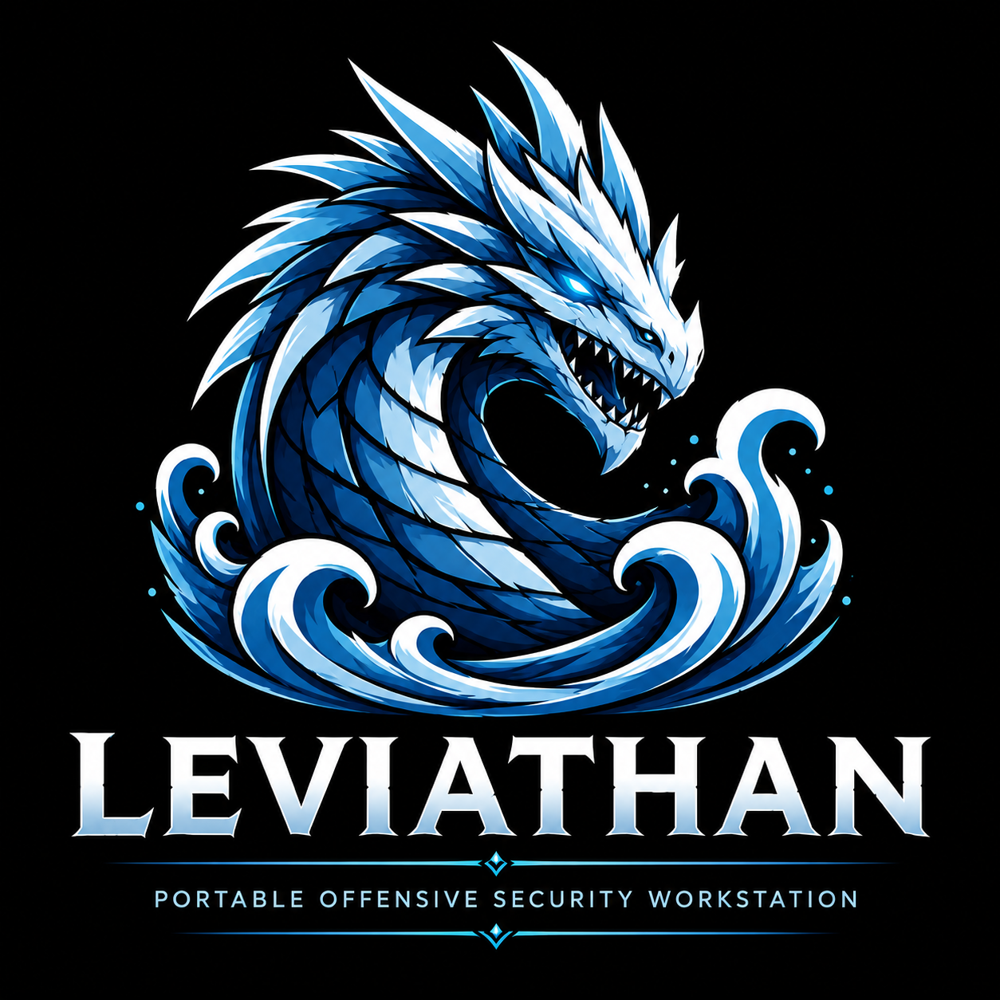

# ⚡ Leviathan OffSec

<div align="center">

    
<pre style="color:#ff5064;">
 ██╗     ███████╗██╗   ██╗██╗ █████╗ ████████╗██╗  ██╗ █████╗ ███╗   ██╗
 ██║     ██╔════╝██║   ██║██║██╔══██╗╚══██╔══╝██║  ██║██╔══██╗████╗  ██║
 ██║     █████╗  ██║   ██║██║███████║   ██║   ███████║███████║██╔██╗ ██║
 ██║     ██╔══╝  ╚██╗ ██╔╝██║██╔══██║   ██║   ██╔══██║██╔══██║██║╚██╗██║
 ███████╗███████╗ ╚████╔╝ ██║██║  ██║   ██║   ██║  ██║██║  ██║██║ ╚████║
 ╚══════╝╚══════╝  ╚═══╝  ╚═╝╚═╝  ╚═╝   ╚═╝   ╚═╝  ╚═╝╚═╝  ╚═╝╚═╝  ╚═══╝

Offensive Security • Dockerized • Reproducible • Fast Deploy 
</pre>

<p align="center">
  
</p>

<p align="center">
  <a href="https://hub.docker.com/r/l1m4/leviathan">
    
  </a>
  <a href="https://github.com/flfelipelima/leviathanOffSec">
    
  </a>
  <a href="https://www.linkedin.com/in/flfelipelima/">
    
  </a>
</p>

<p align="center">
  
  
  
  
</p>

</div>

## 📌 Overview

**Leviathan** is a portable offensive security workstation that lives inside a single Docker container. Built on Kali Linux rolling, it ships 50+ hand-picked tools, a fully-configured ZSH environment with Dracula/Powerlevel10k, and persistent wordlists — assembled once and ready for bug bounty, pentesting, and red team operations from day one.

Forget spending hours installing conflicting packages, chasing missing dependencies, or rebuilding your environment every time you move machines. Leviathan gives you one image that builds once and runs anywhere, isolated from your host.


```
One image. One container. Every tool you need.
```

Instead of polluting your host with dozens of conflicting packages, Leviathan gives you an isolated, reproducible, fully-armed environment that starts in seconds and disappears without a trace when you're done. Fresh VPS, borrowed laptop, new Kali install — it doesn't matter. One command and you're fully armed.

```bash
./leviathan.sh install   # build + start + pull wordlists
./leviathan.sh shell     # drop in and go
```

---

| Area | Purpose |
|---|---|
| Bug Bounty | Recon, web testing, automation and scanning |
| Pentest | Network, web, exploit and password testing |
| Red Team Labs | Isolated tooling environment |
| Learning | Reproducible security lab |
| Portability | Same environment across machines |

Instead of installing dozens of tools directly on your host system, Leviathan provides a clean and reproducible containerized environment.

---

## ✨ Features

| Feature | Description |
|---|---|
| Single Image | Uses one image: `leviathan:latest` |
| Single Container | Runs as one offensive workstation container |
| Persistent Workspace | Project files are mounted into `/workspace` |
| Persistent Configs | ZSH, Powerlevel10k and tmux configs are mounted |
| Wordlists Volume | SecLists and rockyou.txt stored in Docker volume |
| Host Networking | Uses host network mode for realistic scanning |
| Raw Socket Support | Supports tools like `nmap`, `masscan`, `tcpdump` |
| Custom Shell | Oh My Zsh + Powerlevel10k + Dracula |
| Fast Startup | Build once, run whenever needed |
| Easy Cleanup | Remove containers/images/volumes with one command |

---

## 👤 Creator

| Field | Info |
|---|---|
| Creator | Felipe **"l1m4"** Lima |
| Focus | Offensive Security, Bug Bounty, Pentest Automation |
| Project | Leviathan Offensive Security Workstation |

---

## Install

```bash
# Clone the repository
git clone https://github.com/flfelipelima/leviathan.git
cd leviathan

# Make the controller executable
chmod +x leviathan.sh

# Full setup — builds image, starts container, downloads wordlists
./leviathan.sh install

# Drop into your offensive workstation
./leviathan.sh shell
```

> **First build** compiles Go tools and installs all packages from Kali's repositories.  
> Expect 10–20 minutes. Every subsequent start is instant.

### Don't have Docker yet?

```bash
# Leviathan installs it for you
sudo ./leviathan.sh install-docker

# Then run the full setup
./leviathan.sh install
```

---

## Architecture

Leviathan is built around a **single image / single container** model — no microservices, no orchestration overhead. One container, your full offensive workstation.

```
leviathan-docker/
├── leviathan.sh              ← Controller: build, start, shell, wordlists, theme
├── docker/
│   ├── Dockerfile            ← kali-rolling + all tools + ZSH + p10k Dracula
│   └── docker-compose.yml    ← Runtime: host network, privileges, volumes
└── configs/
    ├── zshrc                 ← ZSH config: plugins, aliases, functions
    ├── p10k.zsh              ← Powerlevel10k Dracula theme config
    └── tmux.conf             ← tmux: Leviathan dark theme
```

### Container Runtime

```
Host Machine
│
├── ./leviathan.sh          ← You run this
│
└── Docker
    ├── Image: leviathan:latest    (built from kalilinux/kali-rolling)
    ├── Container: leviathan
    │   ├── Network: host mode     ← Full network access, real scanning
    │   ├── Privileged: true       ← Raw sockets, packet crafting
    │   ├── /workspace             ← Your active working directory
    │   └── /wordlists             ← SecLists + rockyou.txt (Docker volume)
    │
    └── Volume: leviathan_wordlists
```

### Why `privileged` + `host` networking?

Security tools need low-level network access that standard Docker networking blocks. Here's what each setting enables:

| Setting | Reason |
|---------|--------|
| `network_mode: host` | Scan real network interfaces, no NAT, realistic results |
| `privileged: true` | Raw packet crafting for nmap, masscan, tcpdump |
| `NET_ADMIN` | Network configuration inside the container |
| `NET_RAW` | Raw socket access for packet-level tools |
| `seccomp: unconfined` | Removes syscall filtering that breaks security tools |

> Only use Leviathan on networks and systems you own or have explicit written authorization to test.

---

## Commands

```
./leviathan.sh <command>
```

### Setup

| Command | Description |
|---------|-------------|
| `install` | Full setup: build image → start container → pull wordlists |
| `install-docker` | Install Docker engine on the host (requires sudo) |
| `build` | Build `leviathan:latest` from the Dockerfile |
| `wordlists` | Download SecLists and rockyou.txt into the Docker volume |
| `theme` | Install Dracula Powerlevel10k theme (clones and applies configs) |

### Runtime

| Command | Description |
|---------|-------------|
| `up` | Start the Leviathan container |
| `down` | Stop and remove the container |
| `shell` | Open an interactive ZSH shell — auto-starts container if stopped |
| `run <cmd>` | Execute a single command inside the container |
| `ps` | Show container status |
| `logs` | Follow container logs |
| `clean` | Remove container, image, and all volumes |
| `help` | Display the help menu |

### Examples

```bash
# Enter the workstation
./leviathan.sh shell

# Run a tool without entering the shell
./leviathan.sh run nmap -sV 192.168.1.1
./leviathan.sh run nuclei -u https://target.com
./leviathan.sh run sqlmap -u "https://target.com/item.php?id=1" --dbs
./leviathan.sh run subfinder -d target.com -silent

# Rebuild after modifying the Dockerfile
./leviathan.sh down
./leviathan.sh build
./leviathan.sh up

# Apply the Dracula theme
./leviathan.sh theme

# Daily workflow
./leviathan.sh up      # start
./leviathan.sh shell   # work
./leviathan.sh down    # done
```

---

## Tools

All tools are installed inside the image, available immediately on shell entry.

### Recon

| Tool | Description |
|------|-------------|
| **subfinder** | Passive subdomain enumeration via 40+ APIs and sources |
| **amass** | Deep attack surface mapping — DNS, certificates, ASN |
| **assetfinder** | Fast asset/subdomain discovery |
| **httpx** | HTTP probing at scale — status, titles, tech stack detection |
| **naabu** | Fast, reliable port scanner written in Go |
| **dnsx** | DNS resolution, bruteforce, and wildcard filtering |
| **nuclei** | Template-based vulnerability scanner (3000+ community templates) |
| **katana** | Next-generation web crawler with JavaScript rendering |
| **gau** | Fetch known URLs from Wayback Machine and Common Crawl |
| **waybackurls** | Pull all known URLs for a domain from Wayback Machine |
| **httprobe** | Probe a list of domains to find live HTTP/HTTPS servers |
| **anew** | Append new lines to files, deduplicate output streams |

### Web Exploitation

| Tool | Description |
|------|-------------|
| **sqlmap** | Automatic SQL injection detection and exploitation |
| **ffuf** | Fast web fuzzer — directories, parameters, virtual hosts |
| **gobuster** | Directory, DNS, and virtual host brute-forcing |
| **feroxbuster** | Recursive content discovery with automatic depth scanning |
| **dirsearch** | Advanced web path enumeration |
| **dirb** | Classic web content scanner |
| **wfuzz** | Web application fuzzer with advanced filtering |
| **whatweb** | Web technology fingerprinting |
| **XSStrike** | Advanced XSS scanner with JS-aware payload generation |
| **arjun** | HTTP parameter discovery (GET, POST, JSON, XML) |
| **qsreplace** | Replace query string values in URLs |

### Network

| Tool | Description |
|------|-------------|
| **nmap** | The standard for network discovery and security auditing |
| **masscan** | Asynchronous TCP port scanner — 10M packets/sec |
| **netcat** | TCP/UDP Swiss army knife |
| **socat** | Bidirectional data relay — sockets, processes, files |
| **tcpdump** | Command-line packet analyzer |
| **tshark** | Wireshark CLI — capture and dissect packets |
| **traceroute** | Network path analysis |
| **dnsutils** | dig, nslookup, and DNS troubleshooting tools |

### Exploitation

| Tool | Description |
|------|-------------|
| **metasploit-framework** | The industry-standard exploitation framework |
| **exploitdb / searchsploit** | Offline search engine for Exploit Database |
| **impacket** | Python implementations of network protocols (SMB, LDAP...) |
| **pwntools** | CTF framework and exploit development library |

### Password Cracking

| Tool | Description |
|------|-------------|
| **hashcat** | World's fastest CPU/GPU password recovery tool |
| **john** | John the Ripper — versatile password cracker |
| **hydra** | Parallel online brute-force (SSH, HTTP, FTP, SMB...) |

### Intelligence & OSINT

| Tool | Description |
|------|-------------|
| **shodan** | Python library for Shodan internet search engine |
| **whois** | Domain and IP ownership information |

### Utilities

| Tool | Description |
|------|-------------|
| **jq** | JSON processor — slice, filter, and transform JSON |
| **fzf** | Interactive fuzzy finder for terminal |
| **ripgrep** | Ultra-fast recursive search through files |
| **fd-find** | Fast and user-friendly alternative to `find` |
| **bat** | `cat` with syntax highlighting and Git integration |
| **tmux** | Terminal multiplexer with Leviathan dark theme |

---

## Terminal Environment

Every shell session inside Leviathan drops you into a fully-configured offensive security terminal.

### Stack

| Component | Details |
|-----------|---------|
| **Shell** | ZSH |
| **Framework** | Oh My Zsh |
| **Theme** | Powerlevel10k + **Dracula** color scheme |
| **Font** | Nerd Font (MesloLGS NF recommended) |
| **Multiplexer** | tmux with custom dark config |

### Powerlevel10k Dracula

The Dracula theme for Powerlevel10k is applied automatically during `install`. It brings the iconic Dracula palette — purples, pinks, and cyans — into your prompt with full git status, execution time, and exit code indicators.

```bash
# Apply or re-apply at any time
./leviathan.sh theme
```

### ZSH Plugins

| Plugin | What it does |
|--------|-------------|
| **zsh-autosuggestions** | Suggests commands from history as you type — press `→` to accept |
| **zsh-syntax-highlighting** | Colors valid commands green, invalid red, in real time |
| **history-substring-search** | `↑` searches history for anything starting with what you typed |
| **colored-man-pages** | Syntax-colored man pages |
| **extract** | Universal `extract <file>` for any archive format |
| **git** | Git aliases and prompt integration |
| **sudo** | Double `Esc` to prepend `sudo` to any command |
| **docker** | Docker command completions |

### Aliases

**Navigation & files**

```bash
ll         # ls -lah --color
la         # ls -la --color
c          # clear
cat        # batcat (syntax-highlighted)
lev        # cd /workspace
workspace  # cd /workspace
reload     # source ~/.zshrc
```

**Recon**

```bash
sub        # subfinder -silent
probehttp  # httpx -silent
portscan   # naabu -silent
vuln       # nuclei -silent
```

**Network**

```bash
myip       # curl https://ipinfo.io/ip
ports      # ss -tulnp
```

**Encoding / crypto**

```bash
urlencode  # URL-encode stdin
urldecode  # URL-decode stdin
b64e       # base64 encode
b64d       # base64 decode
wl         # wc -l (line count)
http       # python3 -m http.server
```

**Wordlists**

```bash
seclists   # ls /wordlists/SecLists/
wordlists  # ls /wordlists/
rockyou    # print path to rockyou.txt
```

**Docker**

```bash
dps        # docker ps
di         # docker images
dex        # docker exec -it
dlog       # docker logs -f
```

### Built-in Functions

```bash
# Subdomain enum → HTTP probe → timestamped output in /workspace/output/
recon target.com

# Check if a port is open
portcheck 192.168.1.1 443

# Extract all URLs from a file
extracturls file.txt

# Create and enter a directory in one command
mkcd scans/target.com
```

### tmux Configuration

| Binding | Action |
|---------|--------|
| `Ctrl+A` | Prefix (replaces `Ctrl+B`) |
| `Prefix + \|` | Vertical split |
| `Prefix + -` | Horizontal split |
| `Prefix + h/j/k/l` | Vim-style pane navigation |
| Mouse | Enabled — click to switch panes |

Status bar: dark `#141414` background with `#ff5064` red accents.

### Recommended Fonts

Set your terminal emulator to one of these Nerd Fonts for correct icon and arrow rendering:

| Font | Notes |
|------|-------|
| **MesloLGS NF** | Best compatibility with Powerlevel10k (official recommendation) |
| **JetBrainsMono Nerd Font** | Clean, modern, excellent readability |
| **FiraCode Nerd Font** | Ligatures + full icon support |

**Where to set it:**

| Terminal | Path |
|----------|------|
| Windows Terminal | Settings → Profile → Appearance → Font face |
| iTerm2 | Preferences → Profiles → Text → Font |
| GNOME Terminal | Preferences → Profile → Text → Custom font |
| Alacritty | `font.normal.family` in `alacritty.toml` |
| Kitty | `font_family` in `kitty.conf` |

---

## Wordlists

Wordlists are stored in a persistent Docker volume (`leviathan_wordlists`) and mounted read-only into the container at `/wordlists`. They survive container restarts and rebuilds.

```bash
# Download or refresh wordlists
./leviathan.sh wordlists
```

### rockyou.txt

The most iconic password list — 14.3 million real passwords from the 2009 RockYou breach. Standard input for any password cracking or credential stuffing workflow.

```
/wordlists/rockyou.txt
134 MB  |  14,341,564 lines
```

### SecLists

The definitive security wordlist collection by Daniel Miessler. Used by professionals worldwide for every stage of testing.

```
/wordlists/SecLists/
├── Discovery/
│   ├── Web-Content/       # directory-list-2.3-medium, raft-*, common, big
│   ├── DNS/               # subdomains-top1million-*, fierce, bitquark
│   └── Infrastructure/    # network ranges, ASN data
├── Passwords/
│   ├── Common-Credentials/ # top-passwords by frequency
│   └── Leaked-Databases/   # real-world breach wordlists
├── Usernames/             # top-usernames, names, email formats
└── Fuzzing/               # special chars, SQLi, XSS, SSTI, path traversal
```

**Common usage:**

```bash
# Directory brute-force
ffuf -w /wordlists/SecLists/Discovery/Web-Content/directory-list-2.3-medium.txt \
     -u https://target.com/FUZZ -mc 200,301,302,403

# Subdomain brute-force
ffuf -w /wordlists/SecLists/Discovery/DNS/subdomains-top1million-5000.txt \
     -u https://FUZZ.target.com -mc 200,301

# Password spray
hydra -L /wordlists/SecLists/Usernames/top-usernames-shortlist.txt \
      -P /wordlists/rockyou.txt ssh://192.168.1.100 -t 4
```

---

## Volumes and Mounts

| Source | Container Path | Mode | Purpose |
|--------|---------------|------|---------|
| `leviathan_wordlists` (volume) | `/wordlists` | ro | SecLists + rockyou.txt — persists across rebuilds |
| `./configs/zshrc` | `/root/.zshrc` | rw | Live-edit your ZSH config without rebuilding |
| `./configs/p10k.zsh` | `/root/.p10k.zsh` | rw | Live-edit your Powerlevel10k config |

> **The wordlist volume** persists independently of the image. `./leviathan.sh clean` removes it — use with care if you've downloaded all of SecLists.

> **Config files** are mounted as volumes, so any edits to `configs/zshrc` or `configs/p10k.zsh` on the host are reflected immediately inside a running container — no rebuild needed.

---

## Workspace Layout

Your working directory inside the container is `/workspace`. This maps back to the project root on the host.

Recommended structure for keeping sessions organized:

```bash
mkdir -p /workspace/{targets,scans,loot,notes,reports,screenshots,output}
```

```
/workspace/
├── targets/        # Scope files, IP lists, domain lists
├── scans/          # Raw tool output (nmap XMLs, nuclei results...)
├── loot/           # Credentials, hashes, sensitive data
├── notes/          # Markdown notes per target
├── reports/        # Final deliverables
├── screenshots/    # Evidence captures
└── output/         # recon() function auto-saves here
```

---

## Workflows

### Bug Bounty Recon Pipeline

```bash
# Enter the workstation
./leviathan.sh shell

# Built-in recon function: subfinder → httpx → timestamped file
recon target.com

# Or build a custom pipeline
TARGET="target.com"
subfinder -d "$TARGET" -silent \
  | httpx -silent -title -status-code -tech-detect \
  | tee /workspace/scans/alive_${TARGET}.txt

# Port scan live hosts
cat /workspace/scans/alive_${TARGET}.txt \
  | awk '{print $1}' \
  | naabu -silent \
  | tee /workspace/scans/ports_${TARGET}.txt

# Nuclei on live hosts
nuclei -l /workspace/scans/alive_${TARGET}.txt \
  -t exposures/ -t vulnerabilities/ \
  -silent -o /workspace/scans/vulns_${TARGET}.txt
```

### Directory Fuzzing

```bash
ffuf -w /wordlists/SecLists/Discovery/Web-Content/raft-medium-directories.txt \
     -u https://target.com/FUZZ \
     -mc 200,301,302,403 \
     -o /workspace/scans/dirs.json \
     -of json
```

### SQL Injection

```bash
# From URL
sqlmap -u "https://target.com/item.php?id=1" \
  --level 5 --risk 3 --batch --dbs

# From captured request
sqlmap -r /workspace/request.txt \
  --level 5 --risk 3 --batch --dump
```

### Password Cracking

```bash
# MD5 with rockyou
hashcat -m 0 /workspace/loot/hashes.txt /wordlists/rockyou.txt

# NTLM
hashcat -m 1000 /workspace/loot/ntlm.txt /wordlists/rockyou.txt

# John with SecLists
john /workspace/loot/hashes.txt \
  --wordlist=/wordlists/SecLists/Passwords/Common-Credentials/best1050.txt
```

### Run Without Opening a Shell

```bash
# One-shot recon
./leviathan.sh run subfinder -d target.com -silent

# Quick port scan
./leviathan.sh run nmap -sV -p 80,443,8080,8443 target.com

# Nuclei scan
./leviathan.sh run nuclei -u https://target.com -t exposures/

# Check a hash type
./leviathan.sh run hashcat --identify hash.txt
```

---

## Build Behavior

Docker caches layers aggressively. You only need to rebuild when changing the image itself:

| Changed | Rebuild needed? |
|---------|----------------|
| `docker/Dockerfile` | **Yes** — `./leviathan.sh build` |
| Tool versions in Dockerfile | **Yes** |
| `configs/zshrc` | **No** — mounted as volume, live |
| `configs/p10k.zsh` | **No** — mounted as volume, live |
| `configs/tmux.conf` | **No** |
| `leviathan.sh` | **No** |
| `README.md` | No |

```bash
# Rebuild workflow
./leviathan.sh down
./leviathan.sh build
./leviathan.sh up
./leviathan.sh shell
```

---

## Cleanup

```bash
./leviathan.sh clean
```

This removes the container, the `leviathan:latest` image, and **all volumes** (including wordlists). Use carefully if SecLists took a while to download.

To only stop without removing:

```bash
./leviathan.sh down   # stops and removes container, image persists
```

---

## Author

<br>

**Felipe "l1m4" Lima**  
Offensive Security · Bug Bounty · Pentest Automation

[](https://github.com/flfelipelima)
[](https://www.linkedin.com/in/flfelipelima)

---

## ⚠️ Legal Notice

Leviathan is intended exclusively for:

- Authorized penetration testing engagements
- Bug bounty programs within defined scope
- Personal lab environments and CTFs
- Security education and research

**Do not use against systems you do not own or lack explicit written authorization to test. Unauthorized use is illegal and unethical. The author assumes no responsibility for misuse.**

---

## 📜 License

MIT License

---

## 🐉 Motto

> Build once. Hack anywhere.  
> Stay isolated. Stay reproducible. Stay dangerous — legally.
